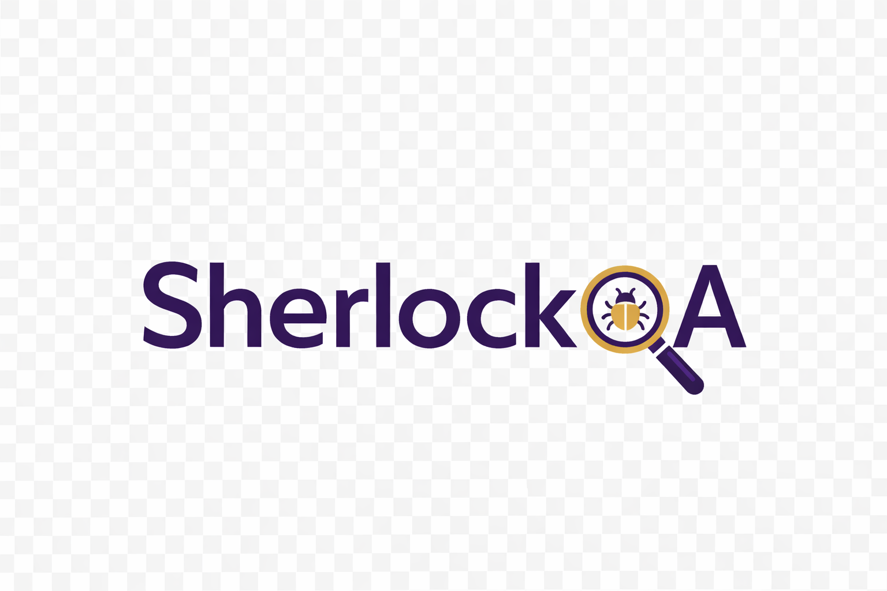

<p align="center">
  
</p>

<h1 align="center">SherlockQA</h1>

<p align="center">
  <em>Elementary, my dear developer. AI-powered code review and quality assurance.</em>
</p>

<p align="center">
  <a href="https://github.com/marketplace/actions/sherlockqa"></a>
  <a href="https://opensource.org/licenses/MIT"></a>
</p>

SherlockQA is a GitHub Action that reviews your pull requests using AI, identifying bugs, security issues, and suggesting QA test scenarios.

## Features

- **AI Code Review** - Analyzes code for bugs, security vulnerabilities, and quality issues
- **Inline Comments** - Posts comments directly on problematic lines
- **QA Test Scenarios** - Suggests manual test cases based on code changes
- **Test Suggestions** - Recommends unit tests when new logic is added
- **Smart Verdicts** - Approves, requests changes, or flags PRs
- **Custom Prompts** - Add domain-specific context for better reviews
- **Multiple AI Providers** - Supports OpenAI, Azure OpenAI, and Azure Responses API
- **Smart Updates** - When a PR is updated, previous reviews are dismissed and checked QA scenarios are preserved
- **Code Quality Analysis** - Optional analysis for repetitive code, complexity, and maintainability

## Quick Start

Add to your workflow (`.github/workflows/sherlockqa.yml`):

```yaml
name: SherlockQA

on:
  pull_request:
    types: [opened, synchronize, reopened]

permissions:
  contents: read
  pull-requests: write

jobs:
  review:
    runs-on: ubuntu-latest
    steps:
      - uses: mayurrawte/SherlockQA@v1
        with:
          github-token: ${{ secrets.GITHUB_TOKEN }}
          openai-api-key: ${{ secrets.OPENAI_API_KEY }}
```

> **💡 Want SherlockQA to approve PRs?** Add `auto-approve: true` and see [Permissions](#enabling-auto-approve) for required setup.

## Inputs

| Input | Description | Required | Default |
|-------|-------------|----------|---------|
| `github-token` | GitHub token for API access | Yes | `${{ github.token }}` |
| `ai-provider` | AI provider (`openai`, `azure`, `azure-responses`) | No | `openai` |
| `openai-api-key` | OpenAI API key | Yes* | - |
| `azure-api-key` | Azure OpenAI API key | Yes* | - |
| `azure-endpoint` | Azure OpenAI endpoint URL | No | - |
| `azure-deployment` | Azure OpenAI deployment name | No | - |
| `azure-api-version` | Azure OpenAI API version | No | `2024-02-15-preview` |
| `model` | Model to use | No | `gpt-4` |
| `min-severity` | Minimum severity to report | No | `warning` |
| `ignore-patterns` | Files to ignore (comma-separated) | No | `*.md,*.txt,...` |
| `persona` | Custom persona/role instructions (e.g., "Act as a security engineer") | No | - |
| `domain-knowledge` | Domain-specific context for better reviews | No | - |
| `max-tokens` | Maximum tokens for AI response | No | `4096` |
| `auto-approve` | Submit APPROVE when verdict is approved (see [Permissions](#permissions)) | No | `false` |
| `code-quality` | Enable code quality analysis (repetitive code, code smells, complexity) | No | `false` |

*Either `openai-api-key` or `azure-api-key` is required based on provider.

## Outputs

| Output | Description |
|--------|-------------|
| `verdict` | Review verdict (`approved`, `needs_changes`, `do_not_merge`) |
| `summary` | Review summary |
| `issues-count` | Number of issues found |

## Usage Examples

### With OpenAI

```yaml
- uses: mayurrawte/SherlockQA@v1
  with:
    github-token: ${{ secrets.GITHUB_TOKEN }}
    openai-api-key: ${{ secrets.OPENAI_API_KEY }}
    model: gpt-4
```

### With Azure OpenAI (Chat Completions API)

```yaml
- uses: mayurrawte/SherlockQA@v1
  with:
    github-token: ${{ secrets.GITHUB_TOKEN }}
    ai-provider: azure
    azure-api-key: ${{ secrets.AZURE_OPENAI_KEY }}
    azure-endpoint: https://your-resource.openai.azure.com
    azure-deployment: gpt-4
```

### With Azure Responses API

```yaml
- uses: mayurrawte/SherlockQA@v1
  with:
    github-token: ${{ secrets.GITHUB_TOKEN }}
    ai-provider: azure-responses
    azure-api-key: ${{ secrets.AZURE_API_KEY }}
    azure-endpoint: https://your-resource.cognitiveservices.azure.com
    azure-api-version: '2025-04-01-preview'
    model: gpt-5.1-codex-mini
```

### With Custom Domain Knowledge

```yaml
- uses: mayurrawte/SherlockQA@v1
  with:
    github-token: ${{ secrets.GITHUB_TOKEN }}
    openai-api-key: ${{ secrets.OPENAI_API_KEY }}
    domain-knowledge: |
      Freight Forwarding SaaS Platform
      This is a logistics/freight forwarding platform. Think about:
      - Weight/Volume: Chargeable weight, unit conversions (kg/lb, cbm/cft)
      - Money: Currency conversions, rate calculations, rounding errors
      - Shipping: FCL/LCL, multi-leg shipments, container types
      - Documents: AWB, Bill of Lading, commercial invoices
      - Timezones: ETD/ETA dates across timezones
      - Edge cases: Zero weight, negative amounts, missing carrier data
```

### With Auto-Approve and Code Quality

```yaml
- uses: mayurrawte/SherlockQA@v1
  with:
    github-token: ${{ secrets.GITHUB_TOKEN }}
    openai-api-key: ${{ secrets.OPENAI_API_KEY }}
    auto-approve: true      # Approves PRs when no issues found
    code-quality: true      # Analyzes for repetitive code, complexity
```

### Full Configuration Example

```yaml
- uses: mayurrawte/SherlockQA@v1
  with:
    github-token: ${{ secrets.GITHUB_TOKEN }}
    ai-provider: azure-responses
    azure-api-key: ${{ secrets.AZURE_API_KEY }}
    azure-endpoint: https://your-resource.cognitiveservices.azure.com
    azure-api-version: '2025-04-01-preview'
    model: gpt-5.1-codex-mini
    min-severity: warning
    max-tokens: '16384'
    ignore-patterns: '*.md,*.txt,package-lock.json,yarn.lock,*.min.js'
    persona: Act as a senior security engineer with expertise in OWASP vulnerabilities
    auto-approve: true
    code-quality: true
    domain-knowledge: |
      Your domain-specific context here...
```

## Example Review

When SherlockQA reviews your PR, you'll see:

```markdown
## 🔍 SherlockQA's Review

### 📝 Summary
This PR adds user authentication with JWT tokens.

### 🧪 Tests Required
⚠️ @author - Please add test cases for this change:
Add unit tests for token validation and expiration handling.

### 🎯 QA Test Scenarios
- [ ] Test login with invalid credentials
- [ ] Test token expiration after 24 hours
- [ ] Test concurrent sessions

### 🧹 Code Quality
Good overall structure with clear separation of concerns.

- Consider extracting token generation logic into a separate utility function
- The validateToken function has high cyclomatic complexity (8 branches)

### 🏁 Verdict
⚠️ Needs Changes
```

> Note: The Code Quality section only appears when `code-quality: true` is set.

## Permissions

### Basic Permissions (Comment Only)

```yaml
permissions:
  contents: read
  pull-requests: write
```

This allows SherlockQA to read the PR diff and post review comments.

### Enabling Auto-Approve

> **⚠️ Why is auto-approve not working?**
>
> By default, GitHub Actions using `GITHUB_TOKEN` cannot approve pull requests. This is a GitHub security feature. If you enable `auto-approve: true` without proper permissions, the action will fall back to posting a `COMMENT` instead of `APPROVE`.

To use `auto-approve: true`, you need **one** of the following:

#### Option 1: Enable in Repository Settings (Recommended)

1. Go to your repository **Settings**
2. Navigate to **Actions** > **General**
3. Scroll down to **Workflow permissions**
4. Check **"Allow GitHub Actions to create and approve pull requests"**
5. Click **Save**

<p align="center">
  
</p>

Then use in your workflow:
```yaml
permissions:
  contents: read
  pull-requests: write

# ...
- uses: mayurrawte/SherlockQA@v1
  with:
    github-token: ${{ secrets.GITHUB_TOKEN }}
    auto-approve: true
    openai-api-key: ${{ secrets.OPENAI_API_KEY }}
```

#### Option 2: Use a Personal Access Token (PAT)

Create a [Personal Access Token](https://github.com/settings/tokens) with `repo` scope and add it as a repository secret:

```yaml
- uses: mayurrawte/SherlockQA@v1
  with:
    github-token: ${{ secrets.PAT_TOKEN }}  # PAT with repo scope
    auto-approve: true
    openai-api-key: ${{ secrets.OPENAI_API_KEY }}
```

> **Note:** Using a PAT means the approval will show as coming from your personal account, not "github-actions[bot]".

## Supported Languages

Works with all languages, with enhanced support for:
Python, JavaScript, TypeScript, Go, Java, C#, Ruby, PHP, Rust

## Privacy

- Only reads PR diffs, not your entire codebase
- Code is sent to your configured AI provider
- No code is stored or logged by SherlockQA

## License

MIT License - see [LICENSE](LICENSE) for details.

## Support

- [GitHub Issues](https://github.com/mayurrawte/SherlockQA/issues)
