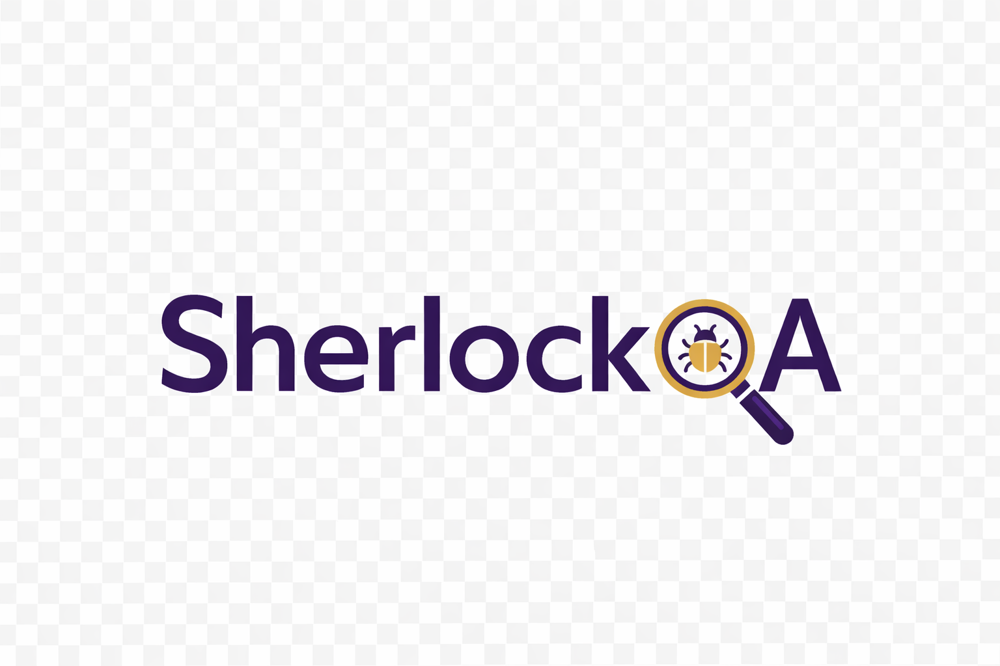

<p align="center">
  
</p>

<h1 align="center">SherlockQA</h1>

<p align="center">
  <em>Elementary, my dear developer. AI-powered code review and quality assurance — works with any LLM.</em>
</p>

<p align="center">
  <a href="https://github.com/marketplace/actions/sherlockqa"></a>
  <a href="https://opensource.org/licenses/MIT"></a>
</p>

SherlockQA is a GitHub Action that reviews your pull requests with AI — identifies bugs, security issues, and suggests QA test scenarios. Works with **OpenAI, Anthropic Claude, Google Gemini, Azure OpenAI, and local models via Ollama**. MIT-licensed, BYO API key — no data leaves your CI.

<!-- Demo GIF — replace `assets/demo.gif` with a real recording -->
<p align="center">
  
</p>

## Features

- **Multi-Provider AI** — OpenAI, Anthropic Claude, Google Gemini, Azure OpenAI, Azure Responses API, and self-hosted Ollama
- **Security Audit Mode** — dedicated SAST-style review focused on injections, auth flaws, secrets, crypto misuse, SSRF, XSS, and more
- **Inline Comments** — posts comments directly on problematic lines
- **QA Test Scenarios** — suggests manual test cases based on code changes
- **Test Suggestions** — recommends unit tests when new logic is added
- **Smart Verdicts** — approves, requests changes, or flags PRs
- **Repo Config** — drop a `.sherlockqa.yml` in the repo root to share defaults across workflows
- **5 Personalities** — `detective`, `bro`, `desi`, `professional`, `enthusiastic`
- **Glob Pattern Ignore** — supports `*`, `**`, and `?` for fine-grained file filtering
- **Resilient** — automatic retry with exponential backoff on rate limits and transient errors
- **Smart Updates** — when a PR is updated, previous reviews are dismissed and checked QA scenarios are preserved
- **Truncation-Aware** — warns reviewers when a PR is too large to fit in one review
- **Custom Prompts** — add domain-specific context and personas

## Quick Start

Add to your workflow (`.github/workflows/sherlockqa.yml`):

```yaml
name: SherlockQA

on:
  pull_request:
    types: [opened, synchronize, reopened]

permissions:
  contents: read
  pull-requests: write

jobs:
  review:
    runs-on: ubuntu-latest
    steps:
      - uses: mayurrawte/SherlockQA@v1
        with:
          github-token: ${{ secrets.GITHUB_TOKEN }}
          openai-api-key: ${{ secrets.OPENAI_API_KEY }}
```

> **💡 Want SherlockQA to approve PRs?** Add `auto-approve: true` and see [Permissions](#enabling-auto-approve) for required setup.

## Inputs

| Input | Description | Required | Default |
|-------|-------------|----------|---------|
| `github-token` | GitHub token for API access | Yes | `${{ github.token }}` |
| `ai-provider` | AI provider (`openai`, `anthropic`, `gemini`, `azure`, `azure-responses`, `ollama`) | No | `openai` |
| `openai-api-key` | OpenAI API key | Yes* | - |
| `anthropic-api-key` | Anthropic API key | Yes* | - |
| `gemini-api-key` | Google Gemini API key | Yes* | - |
| `azure-api-key` | Azure OpenAI API key | Yes* | - |
| `azure-endpoint` | Azure OpenAI endpoint URL | No | - |
| `azure-deployment` | Azure OpenAI deployment name | No | - |
| `azure-api-version` | Azure OpenAI API version | No | `2024-02-15-preview` |
| `ollama-base-url` | Ollama server URL | No | `http://localhost:11434` |
| `model` | Model to use (provider-specific default) | No | see below |
| `mode` | Review mode: `general` or `security` | No | `general` |
| `min-severity` | Minimum severity to report | No | `warning` |
| `ignore-patterns` | Files to ignore (comma-separated globs) | No | `*.md,*.txt,...` |
| `persona` | Custom persona/role instructions | No | - |
| `domain-knowledge` | Domain-specific context for better reviews | No | - |
| `max-tokens` | Maximum tokens for AI response | No | `4096` |
| `auto-approve` | Submit APPROVE when verdict is approved | No | `false` |
| `code-quality` | Enable code quality analysis | No | `false` |
| `review-style` | Output style: `compact` or `detailed` | No | `compact` |
| `use-emoji` | Use emojis in review output | No | `true` |
| `personality` | `detective`, `bro`, `desi`, `professional`, `enthusiastic` | No | `detective` |
| `review-strictness` | `lenient`, `balanced`, `strict` | No | `balanced` |
| `update-summary-comment` | Maintain a single sticky issue-comment with the current summary | No | `true` |
| `create-check-run` | Create a Check Run so verdict appears in the PR Checks column (needs `checks: write`) | No | `true` |

*One of `openai-api-key`, `anthropic-api-key`, `gemini-api-key`, or `azure-api-key` is required, matching the provider.

### Default Models

| Provider | Default Model |
|----------|---------------|
| `openai` | `gpt-4o-mini` |
| `anthropic` | `claude-sonnet-4-5` |
| `gemini` | `gemini-2.0-flash` |
| `ollama` | `llama3.1` |
| `azure` / `azure-responses` | `gpt-4o-mini` |

## Outputs

| Output | Description |
|--------|-------------|
| `verdict` | Review verdict (`approved`, `needs_changes`, `do_not_merge`) |
| `summary` | Review summary |
| `issues-count` | Number of issues found |
| `tokens-in` | Input tokens consumed |
| `tokens-out` | Output tokens generated |
| `cost-usd` | Estimated review cost in USD (set when model is in the pricing table) |

## Usage Examples

### With OpenAI

```yaml
- uses: mayurrawte/SherlockQA@v1
  with:
    github-token: ${{ secrets.GITHUB_TOKEN }}
    openai-api-key: ${{ secrets.OPENAI_API_KEY }}
```

### With Anthropic Claude

```yaml
- uses: mayurrawte/SherlockQA@v1
  with:
    github-token: ${{ secrets.GITHUB_TOKEN }}
    ai-provider: anthropic
    anthropic-api-key: ${{ secrets.ANTHROPIC_API_KEY }}
    model: claude-sonnet-4-5
```

### With Google Gemini

```yaml
- uses: mayurrawte/SherlockQA@v1
  with:
    github-token: ${{ secrets.GITHUB_TOKEN }}
    ai-provider: gemini
    gemini-api-key: ${{ secrets.GEMINI_API_KEY }}
    model: gemini-2.0-flash
```

### With Local Ollama (self-hosted runner)

```yaml
- uses: mayurrawte/SherlockQA@v1
  with:
    github-token: ${{ secrets.GITHUB_TOKEN }}
    ai-provider: ollama
    ollama-base-url: http://localhost:11434
    model: llama3.1
```

### With Azure OpenAI

```yaml
- uses: mayurrawte/SherlockQA@v1
  with:
    github-token: ${{ secrets.GITHUB_TOKEN }}
    ai-provider: azure
    azure-api-key: ${{ secrets.AZURE_OPENAI_KEY }}
    azure-endpoint: https://your-resource.openai.azure.com
    azure-deployment: gpt-4o-mini
```

### Security Audit Mode

```yaml
- uses: mayurrawte/SherlockQA@v1
  with:
    github-token: ${{ secrets.GITHUB_TOKEN }}
    anthropic-api-key: ${{ secrets.ANTHROPIC_API_KEY }}
    ai-provider: anthropic
    mode: security
    review-strictness: strict
```

### With Custom Domain Knowledge

```yaml
- uses: mayurrawte/SherlockQA@v1
  with:
    github-token: ${{ secrets.GITHUB_TOKEN }}
    openai-api-key: ${{ secrets.OPENAI_API_KEY }}
    domain-knowledge: |
      Freight Forwarding SaaS Platform
      - Weight/Volume: Chargeable weight, unit conversions (kg/lb, cbm/cft)
      - Money: Currency conversions, rate calculations, rounding errors
      - Shipping: FCL/LCL, multi-leg shipments, container types
      - Documents: AWB, Bill of Lading, commercial invoices
      - Timezones: ETD/ETA dates across timezones
```

## Repo Config (`.sherlockqa.yml`)

Drop a `.sherlockqa.yml` (or `.sherlockqa.yaml`) at the repo root to share defaults across workflows. Action inputs always win over config-file values.

```yaml
# .sherlockqa.yml
ai-provider: anthropic
model: claude-sonnet-4-5
personality: professional
review-strictness: balanced
ignore-patterns: '*.md,*.txt,**/*.lock,dist/**,build/**,**/__snapshots__/**'
domain-knowledge: |
  Multi-tenant SaaS. Treat any cross-tenant data access as a critical security issue.
  All money is stored as integer cents — flag any floating-point arithmetic on amounts.
```

## Personalities

| Personality | Style | Example |
|-------------|-------|---------|
| `detective` | Sherlock Holmes-style deductive reasoning | "I deduce this null check is missing, Watson!" |
| `bro` | Casual buddy, like your chill dev friend | "bro what is this 😅" / "ngl this looks clean, ship it 🚀" |
| `desi` | Hinglish-speaking desi dev buddy | "arre yaar yeh kya hai 😅" / "sahi hai bhai, ship karo!" |
| `professional` | Formal, enterprise-style | "The implementation is sound. One consideration:" |
| `enthusiastic` | Super positive, gets excited about code | "Love this! 🔥" / "This is *chef's kiss* 👨‍🍳" |

## Example Review (Compact Style — Default)

```markdown
## 🔍 SherlockQA's Review

**Verdict:** ✅ Approved | 0 issues · 2 QA scenarios

**Summary:** Adds user authentication with JWT tokens.

<details>
<summary>🎯 <b>QA Scenarios (2)</b></summary>

- [ ] Test login with invalid credentials
- [ ] Test token expiration after 24 hours

</details>
```

## Permissions

### Basic Permissions (Comment Only)

```yaml
permissions:
  contents: read
  pull-requests: write
  checks: write   # optional, enables Check Run output
```

This allows SherlockQA to read the PR diff and post review comments. The optional `checks: write` permission lets SherlockQA create a Check Run so the verdict surfaces in the PR's *Checks* column. Without it, the action prints a warning and continues — review and inline comments are unaffected.

### Enabling Auto-Approve

> **⚠️ Why is auto-approve not working?**
>
> By default, GitHub Actions using `GITHUB_TOKEN` cannot approve pull requests. This is a GitHub security feature. If you enable `auto-approve: true` without proper permissions, the action will fall back to posting a `COMMENT` instead of `APPROVE`.

To use `auto-approve: true`, you need **one** of the following:

#### Option 1: Enable in Repository Settings (Recommended)

1. Go to your repository **Settings**
2. Navigate to **Actions** > **General**
3. Scroll down to **Workflow permissions**
4. Check **"Allow GitHub Actions to create and approve pull requests"**
5. Click **Save**

Then use in your workflow:
```yaml
permissions:
  contents: read
  pull-requests: write

# ...
- uses: mayurrawte/SherlockQA@v1
  with:
    github-token: ${{ secrets.GITHUB_TOKEN }}
    auto-approve: true
    openai-api-key: ${{ secrets.OPENAI_API_KEY }}
```

#### Option 2: Use a Personal Access Token (PAT)

Create a [Personal Access Token](https://github.com/settings/tokens) with `repo` scope and add it as a repository secret:

```yaml
- uses: mayurrawte/SherlockQA@v1
  with:
    github-token: ${{ secrets.PAT_TOKEN }}
    auto-approve: true
    openai-api-key: ${{ secrets.OPENAI_API_KEY }}
```

> **Note:** Using a PAT means the approval will show as coming from your personal account, not "github-actions[bot]".

## Reviewing PRs from Forks

The default `GITHUB_TOKEN` on `pull_request` events from forks has read-only permissions and can't access secrets. To review fork PRs, switch the trigger:

```yaml
on:
  pull_request_target:
    types: [opened, synchronize, reopened]

permissions:
  contents: read
  pull-requests: write
```

> **⚠️ Security note:** `pull_request_target` runs in the context of the base repo with access to secrets. Do NOT check out the PR head with elevated permissions if you don't trust the contributor.

## Supported Languages

Works with all languages, with enhanced support for:
Python, JavaScript, TypeScript, Go, Java, C#, Ruby, PHP, Rust

## Privacy

- Only reads PR diffs, not your entire codebase
- Code is sent to your configured AI provider
- No code is stored or logged by SherlockQA itself

## License

MIT License - see [LICENSE](LICENSE) for details.

## Documentation

- [ROADMAP](ROADMAP.md) — what's planned next
- [CHANGELOG](CHANGELOG.md) — what's shipped in each release
- [CONTRIBUTING](CONTRIBUTING.md) — how to hack on SherlockQA
- [SECURITY](SECURITY.md) — vulnerability reporting + data handling

## Support

- [GitHub Issues](https://github.com/mayurrawte/SherlockQA/issues)
- [Sponsor on GitHub](https://github.com/sponsors/mayurrawte) — keeps SherlockQA free and MIT
